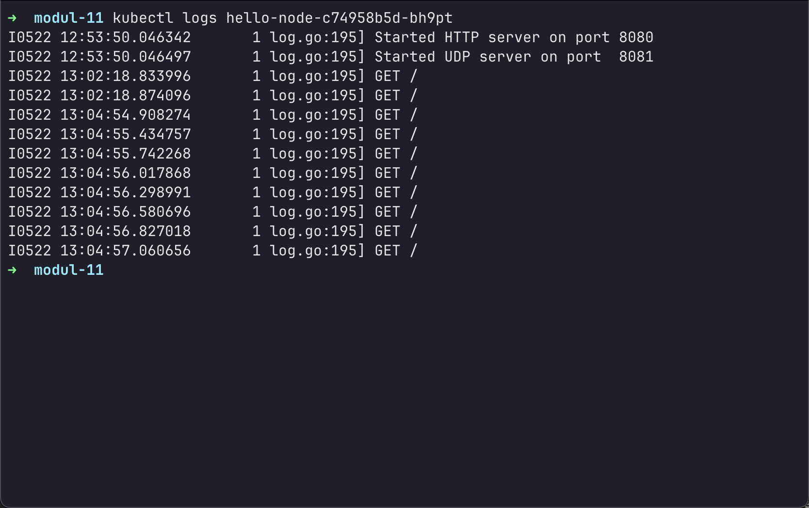

# Reflection on Hello Minikube

## 1. Comparing application logs before and after exposing as a Service

Before exposing the Deployment as a Service, the application logs display the server startup messages (e.g., HTTP server listening on port 8080, UDP server on port 8081) but no incoming request logs. After running `minikube service hellonode` and opening the app multiple times in the browser, each HTTP request generates a new log entry in the container logs. With each refresh, the number of log entries increases, confirming that each request is recorded independently.



## 2. Purpose of the `-n` option in `kubectl get` and why custom resources were not listed

The `-n` (or `--namespace`) option tells `kubectl` to list or operate on resources within a specific Kubernetes namespace. By default, resources are listed from the `default` namespace—where our `hellonode` Deployment and Service reside. When running `kubectl get pods,services -n kube-system`, the command switches to the `kube-system` namespace context and therefore does not show the `hellonode` resources, as they are not located in `kube-system` but in the `default` namespace.

---

# Reflection on Rolling Update & Kubernetes Manifest Files

## 1. Difference between Rolling Update and Recreate deployment strategy

**Rolling Update** is the default deployment strategy in Kubernetes that updates applications with zero downtime. During a rolling update, new pods with the updated version are created incrementally while old pods are terminated gradually. This ensures that some instances of the application remain available throughout the update process. The process is controlled by parameters like `maxUnavailable` and `maxSurge` which determine how many pods can be unavailable or created above the desired replica count during the update.

**Recreate** deployment strategy, on the other hand, terminates all existing pods before creating new ones with the updated version. This approach results in downtime as there's a period where no pods are running the application. However, it's simpler and ensures that only one version of the application runs at any given time, which can be beneficial for applications that cannot handle multiple versions running simultaneously.

## 2. Deploying Spring Petclinic REST using Recreate deployment strategy

To deploy using the Recreate strategy, I modified the deployment configuration to include the `recreate` strategy. Here's the process:

1. First, I deleted the existing deployment:

```bash
kubectl delete deployment spring-petclinic-rest
```

2. Created a new deployment with Recreate strategy:

```bash
kubectl create deployment spring-petclinic-rest --image=docker.io/springcommunity/spring-petclinic-rest:3.0.2
kubectl patch deployment spring-petclinic-rest -p '{"spec":{"strategy":{"type":"Recreate"}}}'
```

3. Verified the deployment strategy:

```bash
kubectl describe deployment spring-petclinic-rest
```

When updating the image with Recreate strategy, all pods are terminated first before new ones are created, causing temporary downtime unlike the rolling update approach.

## 3. Manifest files for Recreate deployment strategy

I prepared separate manifest files for the Recreate deployment strategy:

**deployment-recreate.yaml:**

```yaml
apiVersion: apps/v1
kind: Deployment
metadata:
  name: spring-petclinic-rest-recreate
spec:
  replicas: 4
  strategy:
    type: Recreate
  selector:
    matchLabels:
      app: spring-petclinic-rest-recreate
  template:
    metadata:
      labels:
        app: spring-petclinic-rest-recreate
    spec:
      containers:
        - name: spring-petclinic-rest
          image: docker.io/springcommunity/spring-petclinic-rest:3.0.2
          ports:
            - containerPort: 9966
```

**service-recreate.yaml:**

```yaml
apiVersion: v1
kind: Service
metadata:
  name: spring-petclinic-rest-recreate
spec:
  selector:
    app: spring-petclinic-rest-recreate
  ports:
    - port: 9966
      targetPort: 9966
  type: LoadBalancer
```

The key difference is the `strategy.type: Recreate` specification in the deployment manifest.

## 4. Benefits of using Kubernetes manifest files

Using Kubernetes manifest files provides several significant advantages over manual deployment:

**Version Control & Reproducibility:** Manifest files can be stored in Git repositories, allowing for version control, change tracking, and easy rollbacks. This ensures that deployments are reproducible across different environments.

**Infrastructure as Code:** Manifest files treat infrastructure configuration as code, enabling better collaboration, code reviews, and automated deployments through CI/CD pipelines.

**Declarative Configuration:** Unlike imperative `kubectl` commands, manifest files describe the desired state declaratively. Kubernetes continuously works to maintain this desired state.

**Documentation:** Manifest files serve as living documentation of the application's deployment configuration, making it easier for team members to understand the setup.

**Consistency:** Manual deployments are prone to human error and inconsistency. Manifest files ensure that the same configuration is applied every time.

**Automation:** Manifest files can be easily integrated into automated deployment pipelines, reducing manual intervention and deployment time.

**Environment Management:** Different manifest files can be maintained for different environments (dev, staging, production) with environment-specific configurations.

From my experience, manual deployment required remembering multiple `kubectl` commands and their parameters, making it error-prone and time-consuming. With manifest files, deploying the same application was as simple as running `kubectl apply -f deployment.yaml` and `kubectl apply -f service.yaml`, which is both faster and more reliable.

## 5. Key Learnings and Observations

During this tutorial, I encountered several important insights:

**Context Path Issue:** The Spring Petclinic REST application runs with a context path `/petclinic`, which initially caused 404 errors when accessing the root URL. This highlighted the importance of understanding application configuration and reading application logs carefully.

**Scaling Capabilities:** Kubernetes makes it incredibly easy to scale applications horizontally by simply changing the replica count. The load is automatically distributed across multiple pods.

**Rolling Update Safety:** The rolling update mechanism provides a safety net - if an update fails (like when I tried to deploy version 4.0 which doesn't exist), it can be easily rolled back without affecting the entire application.

**Resource Management:** Through ReplicaSets, Kubernetes ensures that the desired number of pods is always maintained, providing high availability and fault tolerance.

**Service Discovery:** Kubernetes services provide stable endpoints for accessing applications, abstracting away the complexity of pod IP addresses that change during updates.

This tutorial demonstrated the power and flexibility of Kubernetes for container orchestration, particularly its ability to manage application lifecycle, scaling, and updates with minimal downtime and maximum reliability.
